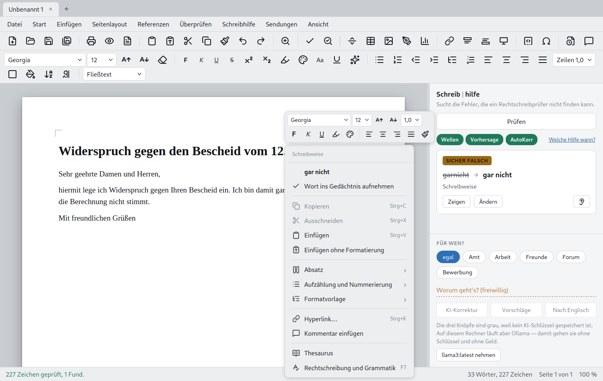

# Schreibhilfe

**Schnellzugriff.** Unter dem Prüfen-Knopf stehen drei Marken — Wellen,
Vorhersage, AutoKorrektur. Grün heißt an, ein Klick schaltet. Sie lagen
vorher in *Extras ▸ Beim Schreiben*, wo sie niemand fand. Daneben führt

**Prüfen.** Der Knopf *Prüfen* (F7) legt jeden Fund als Karte in die
Seitenleiste und zieht im Text eine Wellenlinie darunter. Rechtsklick auf
ein angestrichenes Wort zeigt die Vorschläge — wie in Word. Auf jeder Karte
steht ein **Ohr**: Es liest den Vorschlag samt Begründung vor. Wer zwischen
„das" und „dass" unsicher ist, hört den Unterschied oft schneller, als er
ihn sieht.

**Wortvorhersage.** Ab drei Buchstaben stehen passende Wörter zur Wahl.
Wiedererkennen ist leichter als Erinnern.

**Phonetische Suche.** Wer „kwalität" schreibt, meint *Qualität*; wer
„fileicht" schreibt, meint *vielleicht*. Ein Buchstabenabstand findet das
nicht — der Klang schon (Kölner Phonetik).

## Eine Hilfe, kein Ersatz

> Lunivo-Office ist eine Hilfe und kein Ersatz für eine Kontrolle durch
> eine andere Person. Es kann nicht garantieren, dass der Text oder sein Inhalt
> am Ende vollständig korrekt ist.
>
> Gerade für Menschen mit Legasthenie ist eine zusätzliche Kontrolle durch eine
> zweite Person wichtig. Eigene Fehler werden beim späteren Lesen nicht immer
> erkannt, weil das Gehirn das Geschriebene teilweise so wahrnimmt, wie es
> gemeint war.

Deshalb gibt es *Vorlesen* (F4): Über einen Fehler liest das Auge hinweg, das
Ohr stolpert darüber. Es ersetzt die zweite Person nicht — es kommt ihr nur am
nächsten, wenn gerade niemand da ist.
