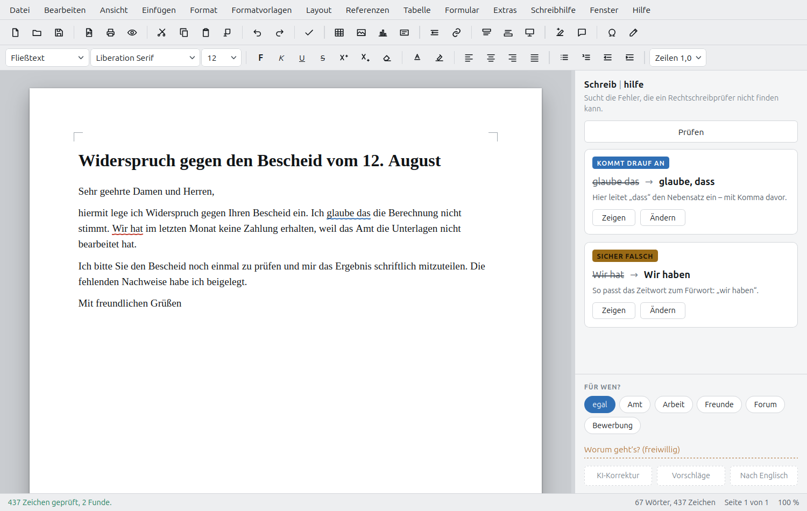
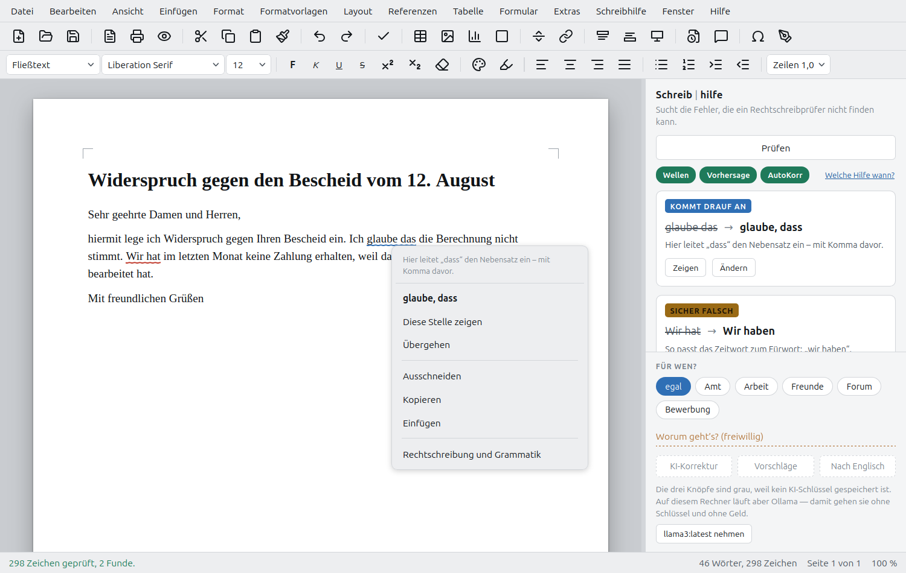
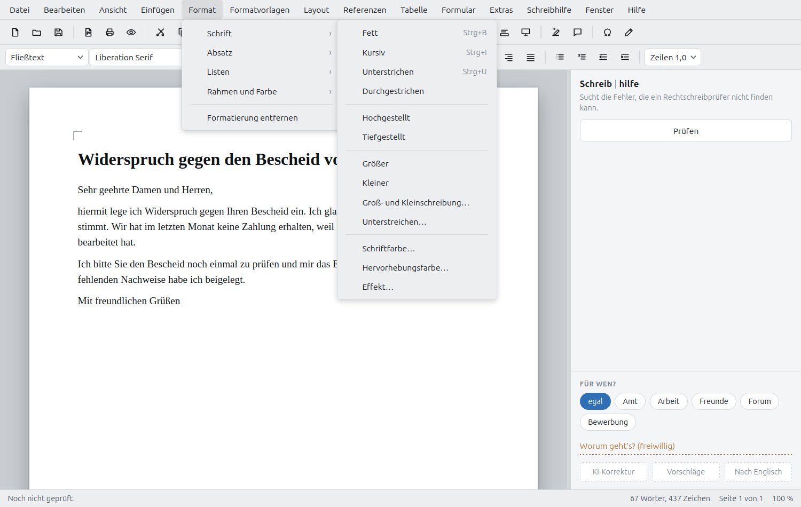
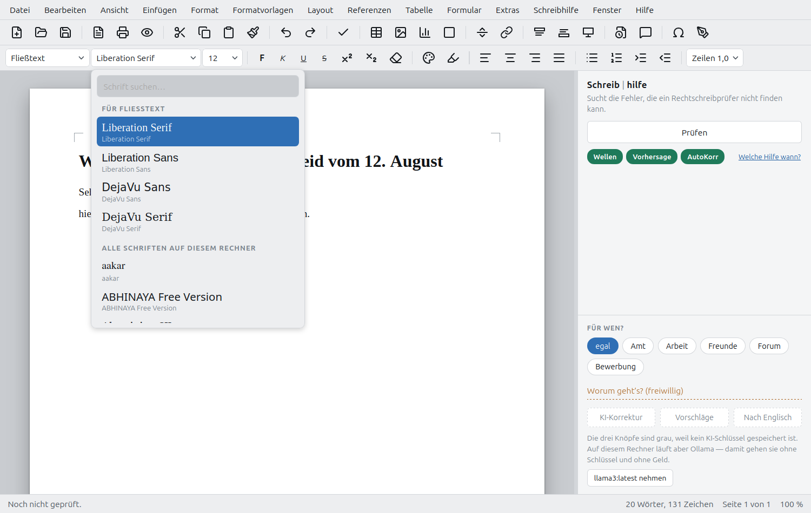
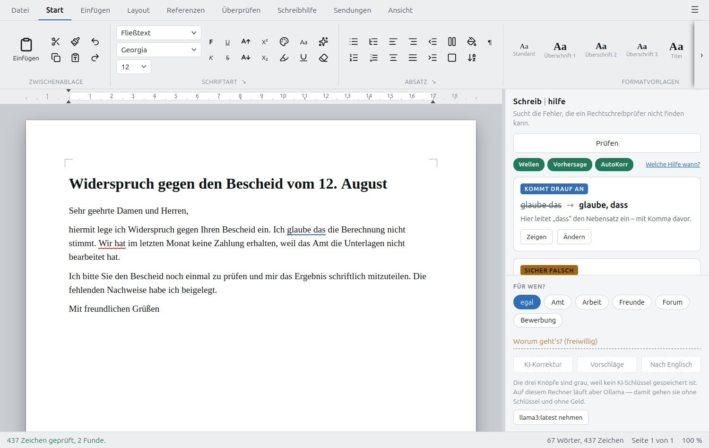
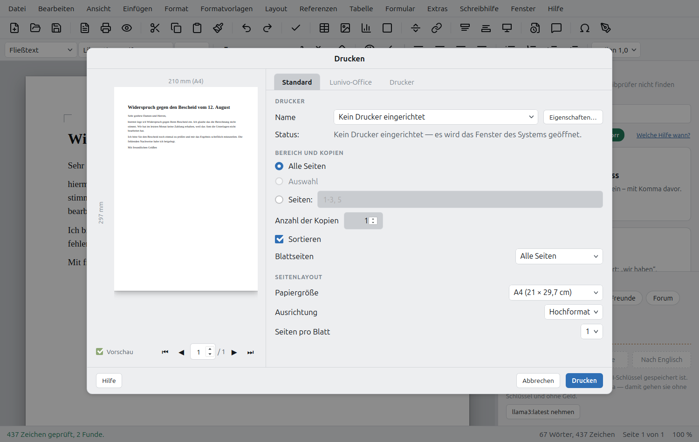
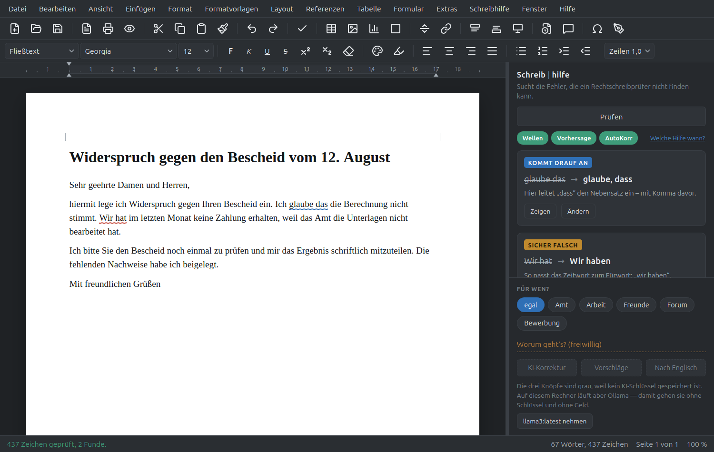
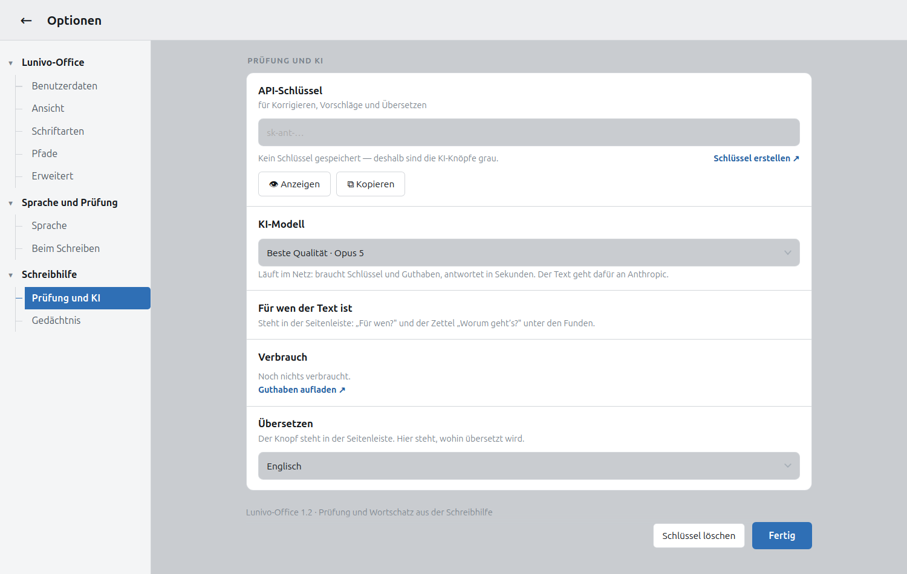

  <picture>
    <source media="(prefers-color-scheme: dark)" srcset="bilder/lunivo-office-dunkel.png">
    
  </picture>

# Lunivo-Office

**Ein Raum für Worte.**  
Was geschrieben wird, bleibt auf diesem Rechner.  
Nichts geht hinaus, ohne dass du es selbst schickst.

Ein Schreibprogramm wie LibreOffice Writer oder Word — mit einem Unterschied:
Die **Schreibhilfe** sitzt fest an der Seite und sucht die Fehler, die ein
Rechtschreibprüfer **nicht** finden kann.

    das / dass       seit / seid       wider / wieder
    „wir hat"  →  „wir haben"          „größer wie"  →  „größer als"
    fehlende Kommas vor weil, dass, wenn, aber
    zusammengetippte Wörter, doppelte Wörter, Satzanfänge

Nicht *für* Menschen mit Legasthenie gebaut, sondern *von* einem —
[wie es dazu kam](doku/ENTSTEHUNG.md).
Kein Konto, keine Anmeldung, kein Internet nötig.

> Die Adresse auf GitHub bleibt `…/schreibprogramm` — eine neue würde jeden
> Link brechen, der schon irgendwo steht. Und wer nach „Schreibprogramm"
> sucht, soll es weiter finden.

## Mach mit

Dieses Projekt sucht Leute — **nicht in erster Linie Programmierer.**

Wenn dir Schreiben schwerfällt, bist du hier die wichtigste Person. Nicht
weil das nett klingt, sondern weil niemand ein Werkzeug bauen kann für eine
Not, von der er nichts weiß. Ein Satz darüber, woran du hängenbleibst, ist
mehr wert als der schönste Quelltext.

> [**Erzähl, woran du hängenbleibst**](../../issues/new?template=erfahrung.yml)
> · [Etwas geht nicht](../../issues/new?template=fehler.yml)
> · [Etwas fehlt](../../issues/new?template=wunsch.yml)
> · [Reden statt melden](../../discussions)

**Rechtschreibung ist dabei egal.** Wirklich — ausgerechnet hier wird
niemand darauf angesprochen.

Gebraucht wird außerdem: Regeln für die Prüfung (samt der Frage, wann sie
falsch wären), Ausprobieren auf anderen Linux-Systemen, ein Flatpak oder
AppImage, und andere Sprachen von Leuten, die sie sprechen.

* [**RICHTUNG.md**](doku/RICHTUNG.md) — wohin das gehen soll, und was es *nicht* wird
* [MITMACHEN](.github/CONTRIBUTING.md) — wie, im Einzelnen
* [Der Ton hier](.github/CODE_OF_CONDUCT.md) — eine Seite statt fünf

## Warum noch ein Schreibprogramm?

Weil die vorhandenen an der falschen Stelle helfen. Ein Rechtschreibprüfer
findet Wörter, die es nicht gibt. Er findet nicht „das" statt „dass" — beide
Wörter gibt es ja. Genau daran scheitert man aber, wenn Schreiben schwerfällt.

Und weil die Prüfung hier **mit Absicht lückenhaft** ist. Regeln, die auch
richtige Sätze anmeckern würden, stehen nicht drin. Wer ohnehin unsicher ist,
den bringt ein falscher Alarm weiter vom Weg ab als eine übersehene Stelle.

Vor allem aber, weil das Problem bei den Wörtern nicht aufhört. Wer auf seine
Rechtschreibung angesprochen wird, wo es um etwas ganz anderes ging, schreibt
irgendwann lieber nichts mehr. Ein Text, der wegen seiner Form nicht gelesen
wird, kommt nicht an — gleich, was drinsteht.

Deshalb ist dieses Programm nicht *für* Menschen mit Legasthenie gebaut,
sondern *von* einem. Das ist kein Werbespruch, sondern der Grund, warum die
Vorschlagsleiste von selbst erscheint, warum auf jeder Karte ein Ohr sitzt
und warum unter *Neu aus Vorlage* fertige Gerüste liegen.

> **Wie das alles entstanden ist**, steht in
> [ENTSTEHUNG.md](doku/ENTSTEHUNG.md) — vom zu kleinen Textfeld auf dem
> Handy bis hierher, aufgeschrieben von dem, der es gebaut hat.

## Was es kann

**Schreiben.** A4, A5, A3, Letter, Legal — hoch oder quer. Überschriften,
Titel, Untertitel, alle Schriften des Rechners mit Vorschau, Farben,
Zeilen- und Absatzabstände, Spalten, Silbentrennung, Zeilennummern.
Tabellen, Bilder, Diagramme, Formen, Formeln, Kopf- und Fußzeilen,
Fußnoten, Endnoten, Inhalts-, Abbildungs- und Stichwortverzeichnis,
Zitate mit Quellenverwaltung, Seriendruck, Umschläge, Etiketten.

**Nicht vor dem leeren Blatt stehen.** *Datei ▸ Neu aus Vorlage* legt alle
Vorlagen als Blätter nebeneinander, mit Suchfeld — so, wie man es aus Word
kennt. Zehn Gerüste sind dabei: Brief, Brief an eine Behörde, Widerspruch,
Bewerbung, Lebenslauf, Krankmeldung, Kündigung, Rechnung, Einladung,
Protokoll.

Darin steht **kein fertiger Text** — nur der Aufbau nach DIN 5008 und in
jeder Lücke ein Wort, das sagt, was dort hinkommt: `«Aktenzeichen des
Bescheids»`. Tab springt zur nächsten Lücke, Tippen ersetzt sie, gedruckt
wird sie nicht. Wer seine Anschrift einmal hinterlegt hat, findet sie samt
Ort und heutigem Datum schon oben stehen.

Denn wer an einem Behördenbrief scheitert, scheitert selten am Schreiben.
Er scheitert an einer Form, die man kennen muss und nirgends erklärt
bekommt.

Die Gerüste werden **nicht** in `~/Vorlagen` geschrieben — der Ordner
gehört dem Menschen. Was dort liegt, steht im zweiten Reiter daneben.

**Schnellzugriff.** Unter dem Prüfen-Knopf stehen drei Marken — Wellen,
Vorhersage, AutoKorrektur. Grün heißt an, ein Klick schaltet. Sie lagen
vorher in *Extras ▸ Beim Schreiben*, wo sie niemand fand. Daneben führt
**Welche Hilfe wann?** (F6) auf die Seite, die alle sechs Stufen erklärt —
und dort lässt sich jede auch gleich umlegen oder auslösen.

**Prüfen.** Der Knopf *Prüfen* (F7) legt jeden Fund als Karte in die
Seitenleiste und zieht im Text eine Wellenlinie darunter. Rechtsklick auf
ein angestrichenes Wort zeigt die Vorschläge — wie in Word. Auf jeder Karte
steht ein **Ohr**: Es liest den Vorschlag samt Begründung vor. Wer zwischen
„das" und „dass" unsicher ist, hört den Unterschied oft schneller, als er
ihn sieht.

**Vorlesen** (F4). Über einen Fehler liest das Auge hinweg; das Ohr stolpert
darüber. Tempo einstellbar.

Die Stimmen des Systems (espeak-ng) klingen dabei zwangsläufig blechern — das
ist Bauart, nicht Einstellung: Sie rechnen Laute zusammen, statt sie aus
Aufnahmen zu setzen. Wer sich einen ganzen Brief anhören will, hört sonst vor
allem espeak. Ein Aufruf holt deshalb eine aufgenommene Stimme:

    ./stimme-holen.sh

Das lädt Piper und die deutsche Stimme „Thorsten" nach `~/.local/share/` —
90 MB, offline, kostenlos, nichts im System und nichts im Projekt. Danach
spricht sie von selbst.

Es gibt sieben deutsche Stimmen, männlich und weiblich:

    ./stimme-holen.sh --liste          zeigen, was es gibt
    ./stimme-holen.sh kerstin ramona   weitere dazu
    ./stimme-holen.sh --alle           alle sieben (~450 MB)

Nach jedem Laden kommt eine Probe. Gewählt wird unter *Schreibhilfe ▸
Vorlesen ▸ Stimme und Tempo*; die espeak-Stimmen bleiben darunter stehen.
Zum Entfernen genügt es, die `.onnx`-Datei zu löschen.

**Lesehilfe** (*Ansicht ▸ Lesehilfe*). Was in jedem Ratgeber zu Legasthenie
oben steht, an einer Stelle: kein reines Weiß, sondern ein Papierton für den
Bildschirm — Creme, Sandgrau, Blassgelb, Blassblau, Blassgrün oder Blassrosa.
Dazu mehr Luft zwischen Buchstaben, Wörtern und Zeilen, in vier Stufen.

Und die **Schreibstelle**: Der Absatz, in dem der Zeiger steht, wird auf
Wunsch etwas größer, der übrige Text tritt zurück. Ein Farbband allein sagt
nur „hier" — lesbarer wird eine Stelle erst, wenn sie größer ist als das,
was um sie herum steht. Vergrößert wird dabei nicht die Schrift, sondern
das Bild: Eine größere Schrift bricht anders um, die Zeile wird eine
andere, und beim Tippen schaukelt sich das auf.

Passend dazu holt `./schrift-holen.sh` drei Schriften, die eigens fürs
leichtere Lesen gemacht sind (siehe unten).

Das alles ändert das Dokument **nicht**. Kein Buchstabe der Datei wird davon
anders, und auf dem Papier steht nachher, was dort stehen soll. Das ist der
Unterschied zu *Seitenfarbe*: Die färbt das Papier und kostet Tinte. Hier
wird nur der Schirm freundlicher.

**Wortvorhersage.** Ab drei Buchstaben stehen passende Wörter zur Wahl.
Wiedererkennen ist leichter als Erinnern.

**Phonetische Suche.** Wer „kwalität" schreibt, meint *Qualität*; wer
„fileicht" schreibt, meint *vielleicht*. Ein Buchstabenabstand findet das
nicht — der Klang schon (Kölner Phonetik).

**KI, wenn man will.** Korrigieren, Umformulieren, Übersetzen — über Claude
im Netz oder über ein Modell auf dem eigenen Rechner (Ollama). Die Korrektur
richtet sich danach, **für wen** der Text ist: Ein Brief ans Amt wird anders
korrigiert als eine Nachricht an einen Freund.

**Speichern.** `.odt`, `.docx`, `.doc`, `.rtf`, `.fodt`, `.html`, `.txt`,
PDF und EPUB. Word-Dateien öffnen und wieder als Word speichern.

**Drucken.** Das Programm rechnet den Seitenumbruch selbst aus, statt ihn
dem Browser zu überlassen: Es füllt ein Blatt, bis es voll ist, und fängt
ein neues an. Kopfzeile, Fußzeile und die *wirkliche* Seitenzahl stehen
deshalb auf jeder Seite. Die **Druckvorschau** zeigt den ganzen Stapel zum
Durchblättern — eine, zwei oder vier Seiten nebeneinander, oder als
aufgeschlagenes Buch.

Das **Druckfenster** ist aufgeteilt wie im Writer: links das Blatt, rechts
in drei Reitern die Einstellungen, unten die Knöpfe. Seitenbereich („1-3,
5"), Kopien, Sortieren, nur gerade oder ungerade Blattseiten, Seiten pro
Blatt. Dazu, was auf das Papier kommt: Seitenhintergrund, Bilder,
Formularfelder, Kommentare, Text schwarz drucken, leere Seiten.

Im dritten Reiter steht der **Drucker** selbst — Name, Zustand, Typ, Ort,
mit Papierformat, beidseitigem Druck, Schacht und Auflösung. Diese Angaben
sind nicht erfunden: Sie kommen von CUPS, dem Druckerdienst des Systems,
derselben Quelle, aus der auch LibreOffice sie hat. Meldet ein Drucker
keine Duplexeinheit, bleibt der Schalter dafür grau. Gedruckt wird direkt
über den Druckerdienst; ist keiner eingerichtet, öffnet das Fenster des
Systems.

**Das Lineal** misst wirklich: Zentimeter mit Zahlen, vom Satzspiegel aus
gezählt wie im Writer, und drei Marken für die Einzüge, die sich ziehen
lassen — erste Zeile, links, rechts. Das helle Band zeigt, wo Text steht,
und wandert beim Ziehen mit.

**Zuletzt verwendet.** Unter *Datei* stehen die letzten zehn Dokumente mit
Namen — ein Klick, und das Blatt ist wieder da. Wer eine Datei inzwischen
verschoben oder weggeworfen hat, findet sie nicht mehr in der Liste: Geprüft
wird beim Aufklappen, nicht beim Merken.

**Zwei Oberflächen.** *Ansicht ▸ Benutzeroberfläche* stellt zwischen
Symbolleisten (zwei Zeilen, alles sichtbar) und Registern (Reiter wie in
Word) um. Dieselben Befehle, anders sortiert.

Das Register hat neun Reiter — Datei, Start, Einfügen, Layout, Referenzen,
Überprüfen, Schreibhilfe, Sendungen, Ansicht — und einen zehnten, der nur
da ist, wenn er etwas zu sagen hat: **Tabelle** erscheint, sobald der
Zeiger in einer Tabelle steht, und verschwindet wieder. Die Gruppen folgen
dem Menüband von Word: *Start* trägt Zwischenablage, Schriftart, Absatz,
Formatvorlagen und Bearbeiten, *Ansicht* beginnt mit den Ansichten und
nicht mit dem Zoom. Jeder der 185 Befehle ist von dort erreichbar. Auf *Start* steht der
**Formatvorlagen-Katalog**: Er zeigt die Vorlage, statt sie zu benennen.
Wo eine Gruppe nicht alles zeigt, was es gibt, steht unten rechts ein
**Pfeil ⭨** zum vollen Dialog. Ein **Doppelklick auf den Reiter** klappt
das Band weg und wieder auf.

Im Register **tritt die Reiterzeile an die Stelle der Menüleiste** — sie
kommt nicht dazu. Beides übereinander fräße genau den Platz, den das
Register gewinnen soll. Das Menü bleibt über das Zeichen ☰ rechts in der
Reiterzeile erreichbar, oder über die Alt-Taste. In der Symbolleisten-Ansicht lässt sich
die Menüleiste ebenfalls ausblenden. Symbolgröße und die Schrift der
Bedienung sind einstellbar — wer die Leisten nicht lesen kann, benutzt sie
nicht.

**Das Register anpassen.** Rechtsklick auf eine freie Stelle im Band, oder
*Ansicht ▸ Oberfläche ▸ Anpassen*: Die Gruppen eines Reiters lassen sich
umsortieren und einzeln ausblenden. Verschoben wird mit zwei Pfeilen und
nicht mit der Maus — Ziehen und Ablegen verlangt eine ruhige Hand, ein
Pfeil nach oben trifft immer. Ausgeblendetes bleibt blass in der Liste
stehen, damit man es zurückholen kann.

**Ein Symbol austauschen.** Rechtsklick auf einen Knopf — im Band wie in
den Symbolleisten. Ein Fenster zeigt, wo die Zeichnung überall benutzt
wird, dazu ein Suchfeld und **1801 Zeichnungen** zur Wahl. Ein Klick, und
sie ist getauscht; „Zurücksetzen" holt die alte zurück. LibreOffice kann
das für seine Symbolleisten, für sein Symbolband nicht — hier geht beides.

**Optionen** (F9). Wie im Writer: links ein Baum, rechts der Bereich.
Benutzerdaten, Ansicht, Schriftarten, Pfade, Sprache, Prüfung und KI,
Gedächtnis — und unter *Erweitert*, was zusätzlich geholt wurde und ob es
da ist. Unter *Extras ▸ Erweiterungsverwaltung* steht dasselbe noch einmal
als eigenes Fenster.

## So sieht es aus

Die Menüs sind nach Themen geordnet und haben Untermenüs, damit keine Liste
länger wird als der Bildschirm.

Die Schriftauswahl zeigt jede Schrift in sich selbst — oben die vier für
Fließtext, darunter alles, was auf dem Rechner liegt.

Wer die Reiter aus Word gewohnt ist, stellt unter *Ansicht ▸
Benutzeroberfläche* um. Über dem Blatt liegt das Lineal mit den
Einzugsmarken.

Gedruckt wird, was die Vorschau zeigt: links das Blatt, rechts die
Einstellungen in drei Reitern.

Hell oder dunkel, je nachdem, was den Augen bekommt. Das Blatt bleibt weiß —
Papier ist weiß.

Auf der Einstellungsseite stehen der Schlüssel für die KI, das Modell, der
Verbrauch und alles zur Darstellung.

## Starten

    ./starten.sh

Das legt beim ersten Mal auch den Menüeintrag an; danach steht
*Lunivo-Office* im Startmenü unter „Büro". Wer noch den alten Eintrag
*Schreibprogramm* hat: Der wird beim Start still mit weggeräumt, damit
nicht beide nebeneinander stehen.

Gebraucht wird GTK mit WebKit:

    sudo apt install python3-gi gir1.2-webkit2-4.1

## Was zusätzlich geholt wird

Zwei Dinge liegen **nicht** in diesem Verzeichnis, weil sie zu groß sind, und
werden bei Bedarf nach `~/.local/share/schreibprogramm/` gelegt — der
Ordner behält seinen alten Namen mit Absicht, denn dort liegt auch alles
Geschriebene und Gelernte:

| | wofür | Größe | nötig? |
|---|---|---|---|
| LibreOffice | Word-Dateien, PDF, EPUB | ~700 MB | nur dafür |
| [LanguageTool](https://languagetool.org/) | „Gründlich prüfen" | ~400 MB | nein, freiwillig |
| [Piper](https://github.com/rhasspy/piper) + Thorsten | eine Stimme, die nicht nach Maschine klingt | ~90 MB | nein, `./stimme-holen.sh` |
| Schriften zum leichteren Lesen | OpenDyslexic, Lexend, Atkinson Hyperlegible | ~4 MB | nein, `./schrift-holen.sh` |

Ist LibreOffice im System installiert, genügt das auch. LanguageTool läuft
als **eigener Prozess** — seine LGPL-Lizenz berührt dieses Programm nicht.

Schreiben, Prüfen, Vorlesen und die ODF-Formate gehen ohne alles davon.

**Die Schriften** landen unter `~/.local/share/fonts/lunivo-office` und
stehen danach oben in der Schriftliste unter *Leichter zu lesen*:

    ./schrift-holen.sh                  OpenDyslexic
    ./schrift-holen.sh lexend atkinson  weitere dazu
    ./schrift-holen.sh --alle           alle drei (~4 MB)
    ./schrift-holen.sh --liste          zeigen, was es gibt
    ./schrift-holen.sh --weg            wieder entfernen

**OpenDyslexic** macht die Buchstaben unten schwerer als oben. Das gibt
ihnen ein Gewicht, und ein Gewicht hat eine Richtung — b und d, p und q
lassen sich dann nicht mehr so leicht verwechseln. **Lexend** ist nicht
gegen das Verwechseln gemacht, sondern für das Tempo: weite Buchstaben,
viel Luft dazwischen. **Atkinson Hyperlegible** kommt vom Braille Institute
und unterscheidet, was einander ähnelt — I, l und 1; O und 0. Alle drei
stehen unter der SIL Open Font License.

## Eine Hilfe, kein Ersatz

> Lunivo-Office ist eine Hilfe und kein Ersatz für eine Kontrolle durch
> eine andere Person. Es kann nicht garantieren, dass der Text oder sein Inhalt
> am Ende vollständig korrekt ist.
>
> Gerade für Menschen mit Legasthenie ist eine zusätzliche Kontrolle durch eine
> zweite Person wichtig. Eigene Fehler werden beim späteren Lesen nicht immer
> erkannt, weil das Gehirn das Geschriebene teilweise so wahrnimmt, wie es
> gemeint war.

Deshalb gibt es *Vorlesen* (F4): Über einen Fehler liest das Auge hinweg, das
Ohr stolpert darüber. Es ersetzt die zweite Person nicht — es kommt ihr nur am
nächsten, wenn gerade niemand da ist.

## Was nicht drin ist

SmartArt in Word-Qualität, 3D-Modelle, eingebettete Tabellenkalkulation,
Design-Themes, Bildumfluss mit Ebenen, Endnoten-Querverweise nach APA im
vollen Umfang, Barrierefreiheitsprüfung über das Geprüfte hinaus,
Dokumentschutz mit Kennwort, Gliederungsansicht zum Verschieben,
Fenster teilen mit Synchronscrollen.

Bei den meisten wäre der Aufwand groß und der Nutzen für einen Brief gering.

## Herkunft

Wie das alles entstanden ist, steht in
[ENTSTEHUNG.md](doku/ENTSTEHUNG.md) — siehe oben.

Die Prüfung und der Wortschatz stammen aus der
[Schreibhilfe](https://github.com/kaysiebke-cell/schreibhilfe) und sind dort
über viele Fassungen gewachsen. Sie liegen hier als eigene Kopie: Dieses
Programm ist eigenständig und braucht jenes Projekt nicht, um zu laufen.

Die Wörterliste (`oberflaeche/daten/woerter.txt`, 355.321 Wörter) ist über viele Sitzungen
selbst aufgebaut worden. Sie stammt aus keiner fremden Quelle und steht
deshalb wie der übrige Code unter MIT.

## Aufbau

    start.py             Fenster, Server, Schriften, LibreOffice, Vorlesen
    starten.sh           startet es und schreibt den Menüeintrag
    stimme-holen.sh      holt Piper und die Stimme „Thorsten“ (freiwillig)
    schrift-holen.sh     holt Schriften zum leichteren Lesen (freiwillig)

    oberflaeche/         alles, was im Fenster zu sehen ist
      index.html         die Oberfläche
      css/programm.css   das Aussehen
      js/programm.js     Menüs, Werkzeuge, Seitenleiste, Statuszeile
      js/dokument.js     das Dokument: lesen, zeigen, ersetzen, formatieren
      js/dateien.js      öffnen und speichern
      js/pruefung.js     die Prüfung, Phonetik, Wortvorhersage
      js/ki.js           Claude und Ollama, Gedächtnis, Sicherung
      js/einstellungen.js  die Einstellungsseite
      daten/regeln.js    der Wortschatz der Prüfung
      daten/woerter.txt  355.321 deutsche Wörter
      daten/symbole.js   die 150 Zeichnungen der Knöpfe
      daten/symbolkatalog.js  1801 Zeichnungen zur Auswahl (erst bei Bedarf geladen)

    werkzeug/            nichts davon lädt das Programm — Werkzeug für die Werkstatt
      symbole.html       den Symbolkatalog durchsehen, im Browser öffnen
      katalog-bauen.py   baut den Katalog aus einem Ordner voller .svg neu
      svg-zu-pfad.py     rechnet <circle>, <rect>, <line> in einen Pfad um
      bildschirmfoto.py  nimmt die Bilder für dieses README auf

    doku/                ENTSTEHUNG, RICHTUNG und das ausführliche LIESMICH
    symbole/             das Symbol als SVG und in allen Größen
    bilder/              Logo, Marke und die Bildschirmfotos

Ausführlicher steht alles in [LIESMICH.md](doku/LIESMICH.md).

## Lizenz

[MIT](LICENSE) — benutzen, ändern und weitergeben ist erlaubt, auch
gewerblich. Der Urhebervermerk muss mitgehen.

LanguageTool und LibreOffice stehen unter eigenen Lizenzen (LGPL-2.1 und
MPL-2.0) und werden als eigene Prozesse aufgerufen, nicht eingebunden.

Die Zeichnungen der Knöpfe stammen größtenteils aus
[Lucide](https://lucide.dev) und stehen unter der ISC-Lizenz; der
Lizenztext liegt in [doku/LIZENZ-LUCIDE.txt](doku/LIZENZ-LUCIDE.txt).
Ein paar sind von Hand gezeichnet — Kopfzeile, Fußzeile, Seitenzahl,
Textbegrenzungen: die kennt nur ein Schreibprogramm.
