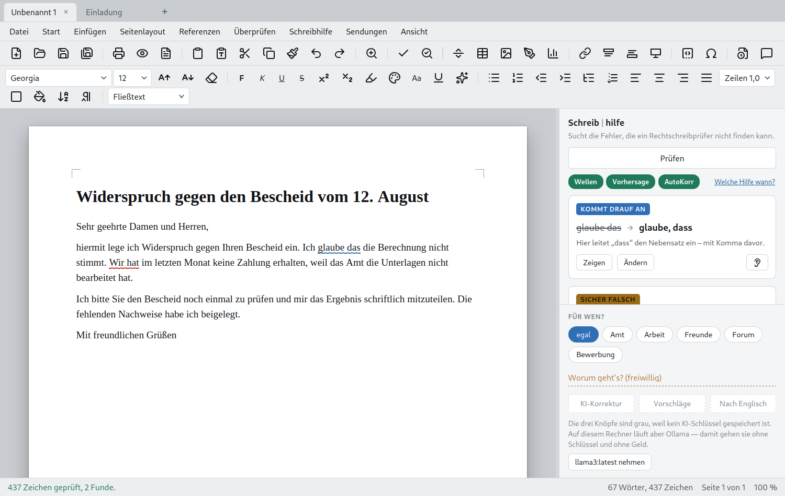
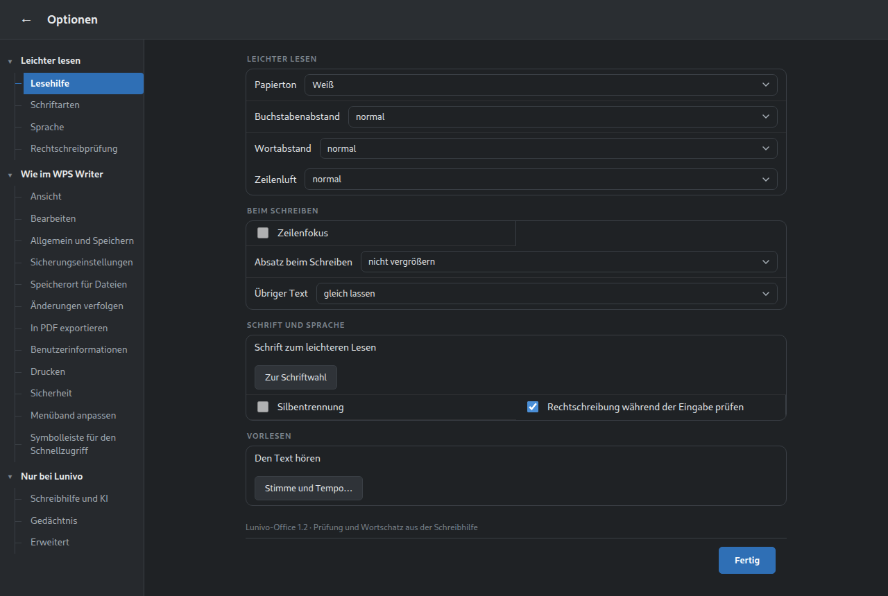
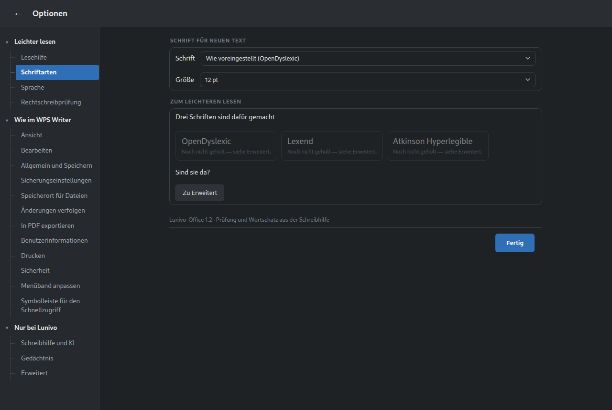
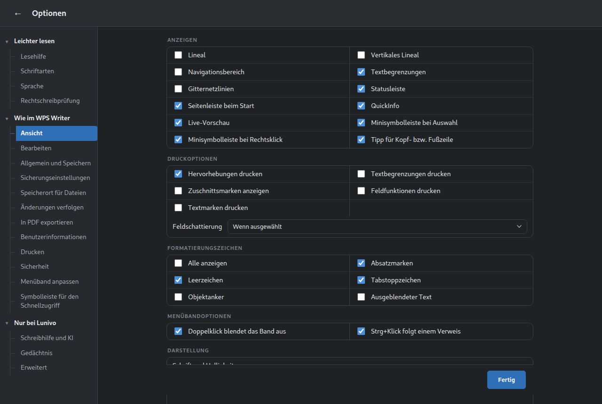
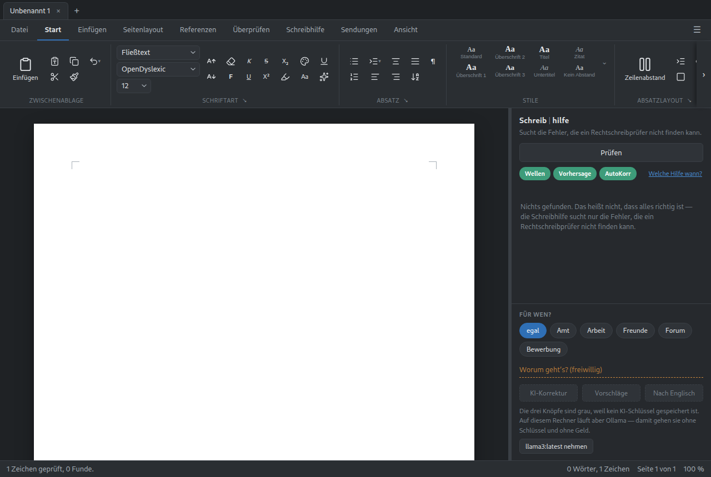
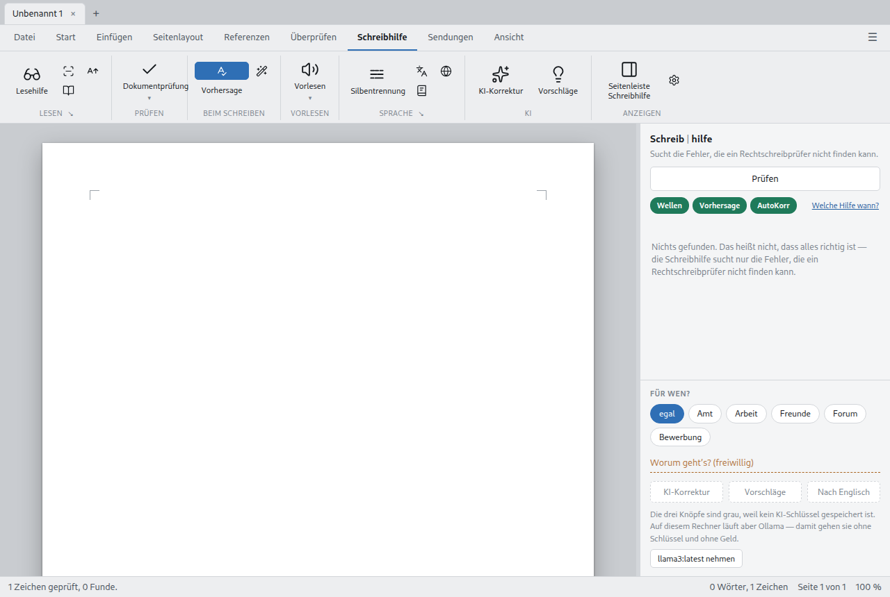

<p align="center">
  <picture>
    <source media="(prefers-color-scheme: dark)" srcset="bilder/lunivo-office-dunkel.png">
    
  </picture>
<p align="center">
  Was geschrieben wird, bleibt auf diesem Rechner.<br>
  Nichts geht hinaus, ohne dass du es selbst schickst.
</p>

<hr>

Ein Schreibprogramm wie LibreOffice Writer oder Word — mit einem Unterschied:
Die **Schreibhilfe** sitzt fest an der Seite und sucht die Fehler, die ein
Rechtschreibprüfer **nicht** finden kann.

```text
das / dass       seit / seid       wider / wieder
„wir hat"  →  „wir haben"          „größer wie"  →  „größer als"
fehlende Kommas vor weil, dass, wenn, aber
zusammengetippte Wörter, doppelte Wörter, Satzanfänge
```

Nicht *für* Menschen mit Legasthenie gebaut, sondern *von* einem —
[wie es dazu kam](doku/ENTSTEHUNG.md).
Kein Konto, keine Anmeldung, kein Internet nötig.



## Mach mit

Dieses Projekt sucht Leute — **nicht in erster Linie Programmierer.**

Wenn dir Schreiben schwerfällt, bist du hier die wichtigste Person. Nicht
weil das nett klingt, sondern weil niemand ein Werkzeug bauen kann für eine
Not, von der er nichts weiß. Ein Satz darüber, woran du hängenbleibst, ist
mehr wert als der schönste Quelltext.

> [**Erzähl, woran du hängenbleibst**](../../issues/new?template=erfahrung.yml)
> · [Etwas geht nicht](../../issues/new?template=fehler.yml)
> · [Etwas fehlt](../../issues/new?template=wunsch.yml)
> · [Reden statt melden](../../discussions)

**Rechtschreibung ist dabei egal.** Wirklich — ausgerechnet hier wird
niemand darauf angesprochen.

Gebraucht wird außerdem: Regeln für die Prüfung (samt der Frage, wann sie
falsch wären), Ausprobieren auf anderen Linux-Systemen, ein Flatpak oder
AppImage, und andere Sprachen von Leuten, die sie sprechen.

## Deine Erfahrung zählt

Du möchtest erst einmal lesen, was hinter Lunivo-Office steckt, Fragen
stellen oder deine Erfahrungen teilen?

Dann komm in die [**GitHub Discussions**](../../discussions).

Dort kannst du erzählen, was dir beim Schreiben schwerfällt, Fragen stellen,
Vorschläge machen oder einfach mit anderen über das Projekt sprechen.

**Besonders wichtig:** Du musst dafür kein Programmierer sein. Und deine
Rechtschreibung spielt hier keine Rolle.

* [**RICHTUNG.md**](doku/RICHTUNG.md) — wohin das gehen soll, und was es *nicht* wird
* [MITMACHEN](.github/CONTRIBUTING.md) — wie, im Einzelnen
* [Der Ton hier](.github/CODE_OF_CONDUCT.md) — eine Seite statt fünf

## Warum noch ein Schreibprogramm?

Weil die vorhandenen an der falschen Stelle helfen. Ein Rechtschreibprüfer
findet Wörter, die es nicht gibt. Er findet nicht „das" statt „dass" — beide
Wörter gibt es ja. Genau daran scheitert man aber, wenn Schreiben schwerfällt.

Und weil die Prüfung hier **mit Absicht lückenhaft** ist. Regeln, die auch
richtige Sätze anmeckern würden, stehen nicht drin. Wer ohnehin unsicher ist,
den bringt ein falscher Alarm weiter vom Weg ab als eine übersehene Stelle.

Vor allem aber, weil das Problem bei den Wörtern nicht aufhört. Wer auf seine
Rechtschreibung angesprochen wird, wo es um etwas ganz anderes ging, schreibt
irgendwann lieber nichts mehr. Ein Text, der wegen seiner Form nicht gelesen
wird, kommt nicht an — gleich, was drinsteht.

Deshalb ist dieses Programm nicht *für* Menschen mit Legasthenie gebaut,
sondern *von* einem. Das ist kein Werbespruch, sondern der Grund, warum die
Vorschlagsleiste von selbst erscheint, warum auf jeder Karte ein Ohr sitzt
und warum unter *Neu aus Vorlage* fertige Gerüste liegen.

> **Wie das alles entstanden ist**, steht in
> [ENTSTEHUNG.md](doku/ENTSTEHUNG.md) — vom zu kleinen Textfeld auf dem
> Handy bis hierher, aufgeschrieben von dem, der es gebaut hat.

## Was es kann

**Für Menschen, denen Lesen und Schreiben schwerfallen.** Die Grundschrift
ist OpenDyslexic, die Lesehilfe liegt auf **F2**, und alles, was dabei
hilft, steht im Reiter *Schreibhilfe* beieinander statt über fünf Reiter
verteilt.

**Prüfung ohne Internet.** 355.322 Wörter und eigene Regeln finden, was ein
Rechtschreibprüfer nicht findet — das/dass, wider/wieder, Kommas. Die KI ist
freiwillig und braucht einen eigenen Schlüssel; ohne sie läuft alles Übrige.

**Ein vollständiges Schreibprogramm.** Neun Register nach dem Vorbild des
WPS Writer, zwei Oberflächen zur Wahl, Formatvorlagen, Tabellen, Kopf- und
Fußzeilen, Seriendruck, Druckvorschau, PDF-Export. Die Optionen tragen alle
dreizehn Seiten von WPS, dazu drei eigene.

**Was geschrieben wird, bleibt hier.** Kein Konto, keine Cloud, kein
Mitlesen. Die Einstellungen liegen als lesbare Datei unter
`~/.config/lunivo-office/einstellungen.conf`.

---

## Die Dokumentation

Der README sagt, was es ist. Was es im Einzelnen tut, steht in den fünf
Dateien darunter — sonst wäre er dreißig Seiten lang und niemand fände
darin, was er sucht.

|                                                                | Worum es geht                                       |
| -------------------------------------------------------------- | --------------------------------------------------- |
| 1 · [Lesen und Schreiben](doku/lesen-und-schreiben.md)         | Lesehilfe, Schriften für Legasthenie, Vorlesen      |
| 2 · [Prüfung, Vorhersage und KI](doku/pruefung-und-ki.md)      | Was gefunden wird, und was die KI dabei tut         |
| 3 · [Schreiben und Dokumente](doku/schreiben-und-dokumente.md) | Das Blatt, Vorlagen, Speichern, Drucken             |
| 4 · [Die Oberfläche](doku/oberflaeche.md)                      | Band und Leisten, Lineale, Formatvorlagen, Anpassen |
| 5 · [Die Einstellungen](doku/einstellungen.md)                 | Das Optionen-Fenster, Sprachen, Kennwort            |

Dazu im Programm selbst: **☰ Menü → Hilfe → Handbuch** — ausführlicher als alles
hier, mit Bildern und Tastenkürzeln.

| Weiteres                                            |                                                   |
| --------------------------------------------------- | ------------------------------------------------- |
| [Was zusätzlich geholt wird](doku/erweiterungen.md) | LibreOffice, LanguageTool, Stimmen, Schriften     |
| [Der Aufbau des Projekts](doku/projektaufbau.md)    | Welche Datei was tut                              |
| [Die lange Fassung](doku/LIESMICH.md)               | Alles ausführlich, auf Deutsch                    |
| [Wie es entstanden ist](doku/ENTSTEHUNG.md)         | Die Geschichte dahinter                           |
| [Wohin es geht](doku/RICHTUNG.md)                   | Was noch kommen soll                              |
| [Der Aufbau des Bandes](doku/aufbau-band.md)        | Alle acht Reiter, mit Tabelle „wo finde ich was"  |
| [Der Aufbau der Optionen](doku/aufbau-optionen.md)  | Alle Seiten und Felder, ebenso                    |
| [Der Ist-Stand am Stück](doku/aufbau-ist-stand.md)  | Bänder und Optionen zusammen, wie sie gerade sind |

Diese drei werden **erzeugt**, nicht geschrieben —
`python3 werkzeug/aufbau-schreiben.py` liest sie aus dem Programm. Die
Vorgabe daneben, `WPS Office/Lunivo-Office_WPS-Writer-Struktur.md`, ist
von Hand geschrieben und sagt, wie es sein **soll**. Weichen die beiden
voneinander ab, zieht der Code nach — nie die Vorgabe.

## So sieht es aus

Der Reiter **Schreibhilfe** trägt alles, was das Lesen und Schreiben
erleichtert. Der Text steht in OpenDyslexic.


Die **Lesehilfe** ist die erste Seite der Optionen (**F9**). Jede Wahl
wirkt sofort auf dem Blatt — kein „Übernehmen", kein Fenster, das über dem
Text liegt, den man beurteilen will.



Unter **Schriftarten** stehen die drei Leseschriften als Knöpfe, jede in
ihrer eigenen Schrift — man muss ihren Namen nicht kennen.



Die Optionen tragen **alle dreizehn Seiten** des WPS Writer, zweispaltig
und kompakt wie dort — hier die Seite *Ansicht*.



Wer die Reiter aus Word gewohnt ist, findet sie unter *Ansicht ▸
Darstellung ▸ Benutzeroberfläche*. Über dem Blatt liegt das Lineal mit den
Einzugsmarken, links das senkrechte.



Hell oder dunkel, je nachdem, was den Augen bekommt.



## Starten

```text
./starten.sh
```

Das legt beim ersten Mal auch den Menüeintrag an; danach steht
*Lunivo-Office* im Startmenü unter „Büro". Wer noch den alten Eintrag
*Schreibprogramm* hat: Der wird beim Start still mit weggeräumt, damit
nicht beide nebeneinander stehen.

Gebraucht wird GTK mit WebKit:

```text
sudo apt install python3-gi gir1.2-webkit2-4.1
```

## Eine Hilfe, kein Ersatz

> Lunivo-Office ist eine Hilfe und kein Ersatz für eine Kontrolle durch
> eine andere Person. Es kann nicht garantieren, dass der Text oder sein Inhalt
> am Ende vollständig korrekt ist.
>
> Gerade für Menschen mit Legasthenie ist eine zusätzliche Kontrolle durch eine
> zweite Person wichtig. Eigene Fehler werden beim späteren Lesen nicht immer
> erkannt, weil das Gehirn das Geschriebene teilweise so wahrnimmt, wie es
> gemeint war.

Deshalb gibt es *Vorlesen* (F4): Über einen Fehler liest das Auge hinweg, das
Ohr stolpert darüber. Es ersetzt die zweite Person nicht — es kommt ihr nur am
nächsten, wenn gerade niemand da ist.

## Was nicht drin ist

SmartArt in Word-Qualität, 3D-Modelle, eingebettete Tabellenkalkulation,
Design-Themes, Bildumfluss mit Ebenen, Endnoten-Querverweise nach APA im
vollen Umfang, Barrierefreiheitsprüfung über das Geprüfte hinaus,
Dokumentschutz mit Kennwort, Gliederungsansicht zum Verschieben,
Fenster teilen mit Synchronscrollen.

Bei den meisten wäre der Aufwand groß und der Nutzen für einen Brief gering.

## Herkunft

Wie das alles entstanden ist, steht in
[ENTSTEHUNG.md](doku/ENTSTEHUNG.md) — siehe oben.

Die Prüfung und der Wortschatz stammen aus der
[Schreibhilfe](https://github.com/kaysiebke-cell/schreibhilfe) und sind dort
über viele Fassungen gewachsen. Sie liegen hier als eigene Kopie: Dieses
Programm ist eigenständig und braucht jenes Projekt nicht, um zu laufen.

Die Wörterliste (`oberflaeche/daten/woerter.txt`, 355.324 Wörter) ist über viele Sitzungen
selbst aufgebaut worden. Sie stammt aus keiner fremden Quelle und steht
deshalb wie der übrige Code unter MIT.

## Lizenz

[MIT](LICENSE) — benutzen, ändern und weitergeben ist erlaubt, auch
gewerblich. Der Urhebervermerk muss mitgehen.

LanguageTool und LibreOffice stehen unter eigenen Lizenzen (LGPL-2.1 und
MPL-2.0) und werden als eigene Prozesse aufgerufen, nicht eingebunden.

Die Zeichnungen der Knöpfe stammen größtenteils aus
[Lucide](https://lucide.dev) und stehen unter der ISC-Lizenz; der
Lizenztext liegt in [doku/LIZENZ-LUCIDE.txt](doku/LIZENZ-LUCIDE.txt).
Ein paar sind von Hand gezeichnet — Kopfzeile, Fußzeile, Seitenzahl,
Textbegrenzungen: die kennt nur ein Schreibprogramm.

